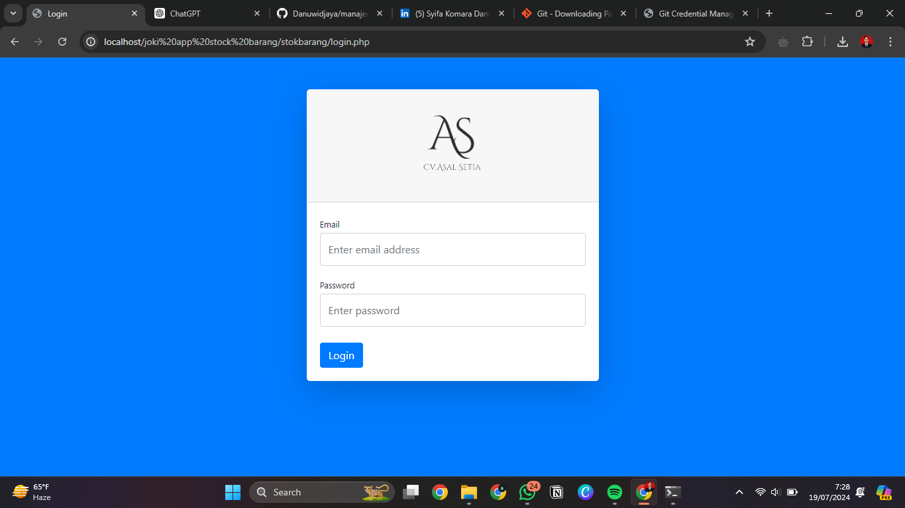
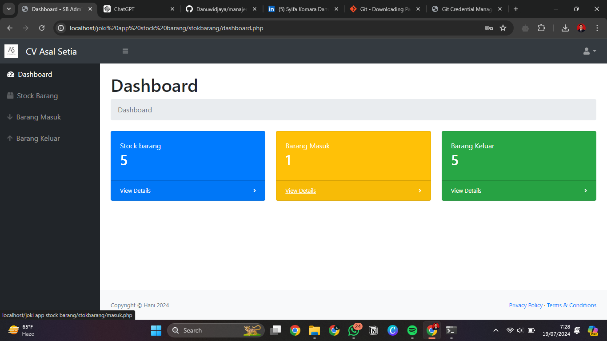
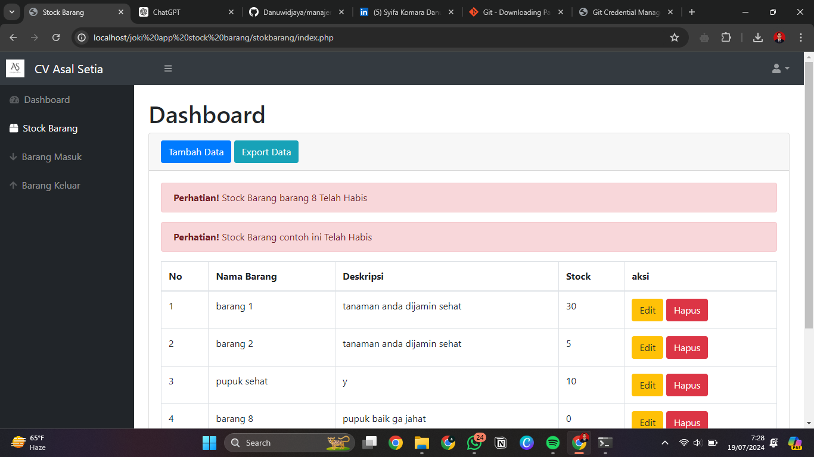
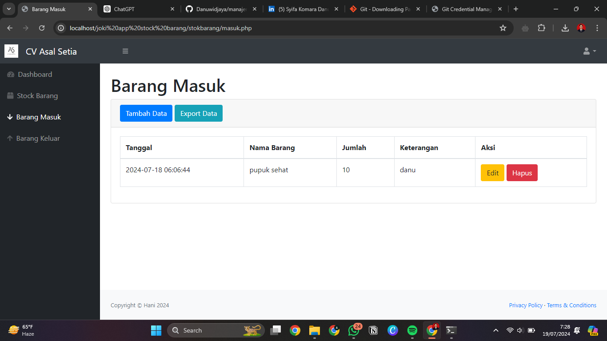
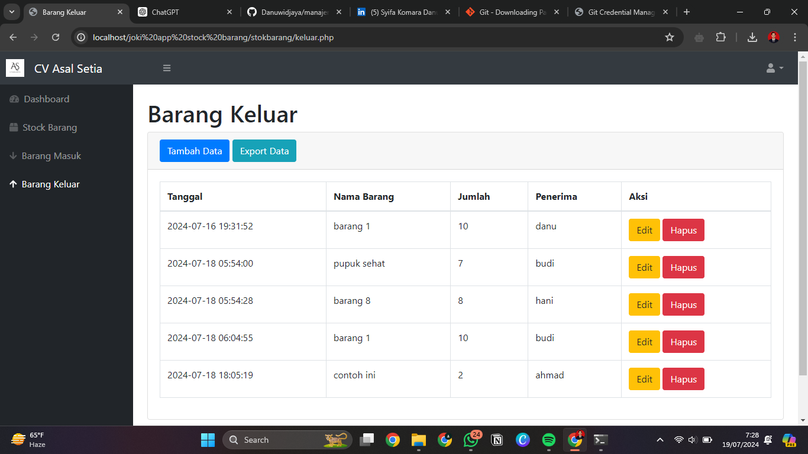
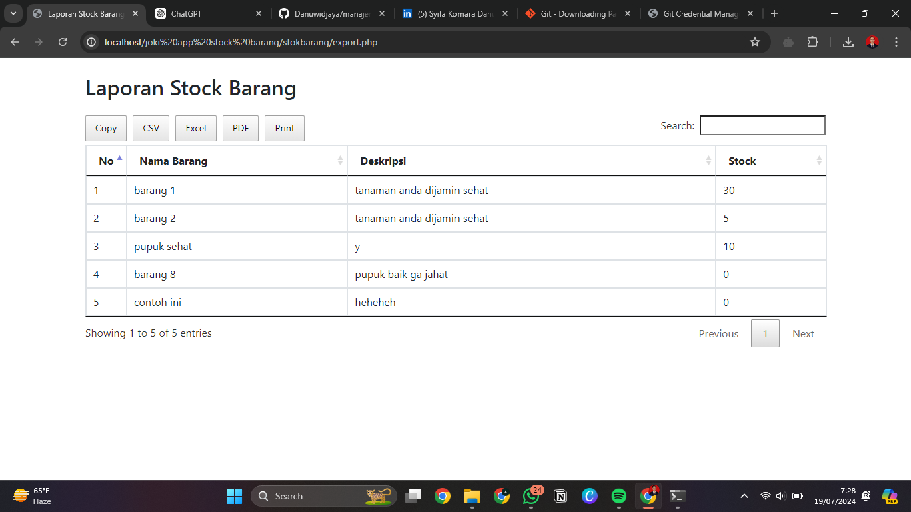

# Manajemen Stok Barang

Aplikasi manajemen stok barang yang membantu mengelola dan melacak persediaan barang dalam gudang. Aplikasi ini menyediakan fitur untuk menambah, mengedit, menghapus, dan melihat data barang, serta mencatat transaksi masuk dan keluar barang.

## Fitur Utama
- **CRUD Barang**: Menambah, mengedit, menghapus, dan melihat data barang.
- **Pencatatan Transaksi**: Mencatat transaksi masuk dan keluar barang.
- **Laporan Stok Real-time**: Menampilkan laporan stok barang secara real-time.
- **Notifikasi Stok Rendah**: Memberikan notifikasi saat stok barang mencapai batas minimum.

## Teknologi yang Digunakan
- **Backend**: PHP
- **Database**: MySQL
- **Frontend**: HTML, CSS, JavaScript, Bootstrap

## Screenshot

### Halaman Login


### Halaman Dashboard


### Halaman Stock Barang


### Halaman Barang Masuk


### Halaman Barang Keluar


### Halaman Report


## Instalasi

### Prasyarat
Pastikan kamu sudah menginstal:
- [PHP](https://www.php.net/downloads)
- [MySQL](https://www.mysql.com/downloads/)
- [Composer](https://getcomposer.org/download/)
  
## Instalasi

1. Clone repositori ini:
   ```sh
   git clone https://github.com/username/manajemen-stock-barang.git
   
2. Masuk ke direktori proyek:
   ```sh
   cd manajemen-stock-barang

3. Buat database baru di MySQL dan import file database.sql:
   ```sh
    mysql -u username -p stockbarang < stock.sql

4. Jalankan aplikasi di server lokal (misalnya, menggunakan XAMPP atau Laragon).

### Penggunaan

1. Buka aplikasi di browser.
2. Login menggunakan akun admin.
3. Mulai mengelola stok barang dengan menambah, mengedit, menghapus, dan melihat data barang.

Lisensi
Proyek ini dilisensikan di bawah MIT License.

## About Me

I am a dedicated IT Support specialist with a passion for technology and problem-solving. With a background in Informatics Engineering and hands-on experience in IT support, I thrive in dynamic and challenging environments. I am constantly seeking opportunities to expand my skills and contribute to meaningful projects.

- **LinkedIn**: [Syifa Komara Danuwidjaya](https://www.linkedin.com/in/syifa-danuwidjaya)
- **Email**: [syifa@example.com](mailto:syifa@example.com)

## Contact

Feel free to reach out to me for any inquiries or collaboration opportunities. You can contact me via [email](mailto:syifa@example.com) or connect with me on [LinkedIn](https://www.linkedin.com/in/syifa-danuwidjaya).

---.

